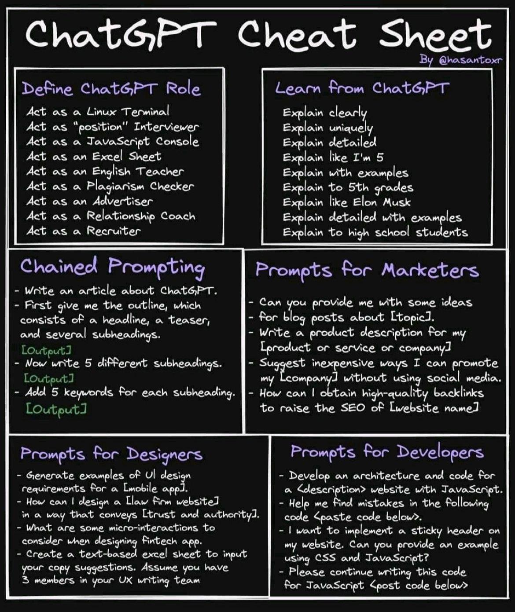

# prompt_academy

**La plupart des prompts utilisés à la fois dans le dispositif ainsi que les sources d'inspirations de ces mêmes prompts.**

.md

- `001_ia_tunisia_1.md` : Liste de prompts pour la formation Jour #1
- `002_ia_all_prompts_1.md` : Liste de prompts glanés sur des sujets variés (SEO, SMO, Summary, NLP...)
- `002_Prompt_Engineering_Course_ollama_lmstudio_light.md` : Utiliser des LLM en local avec ollama.ai ou lmstudio.ai
- `003_lexique_1_IA.md` : Lexique des principaux mots utilisés
- `004_cheat_sheet_chatgpt_v0_yi71i3dbm6ua1.jpg` : Differentes techniques de prompt.

**Pour les prompts le modèle était celui-ci, cheatsheet for chatgpt**

